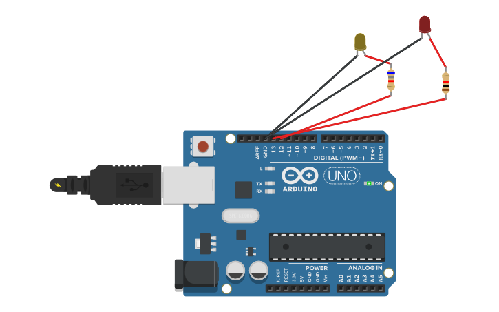
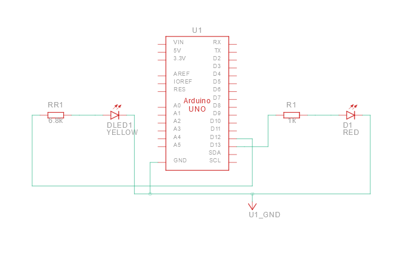

# Circuito com Arduino

##  Descrição:

Para a montagem deste circuito foram usados os seguintes componentes:<ul>
    <li>Arduino Uno R3</li>
    <li>Resistores: 1kΩ e 6.8kΩ</li>
    <li>LEDs</li>
    <li>Fios para conexão: fio vermelho com tensão de 5V e o fio preto é o Terra ou GND (Ground)</li>
</ul>

Descrição:
 

O LED possui dois terminais semicondutores: Ânodo (polaridade positiva) e Cátodo (polaridade negativa). A corrente elétrica passa do ânodo para o cátodo, e se essas polaridades forem invertidas, o led não acende. Podemos reconhecer os terminais desse tipo de LED observando seu formato, onde o ânodo possui um terminal maior e o cátodo possui um terminal mais curto.   

Os terminais negativos dos LEDs são conectados na porta GND do Arduino e os terminais positivos aos resistores, que por sua vez são conectados em diferentes portas no Arduino. Ao ligar a placa, os LEDs ficam acesos por um segundo (1000ms) e depois acendem e apagam (piscam) em intervalo de 0,15 segundos (150 microssegundos [150µs]).  

<h2>Imagens do circuito:</h2> 
<h3>
   Arduino: 
    

        
    

</h3>     
 
<h3>
    Esquema:
    

        
    

</h3>

